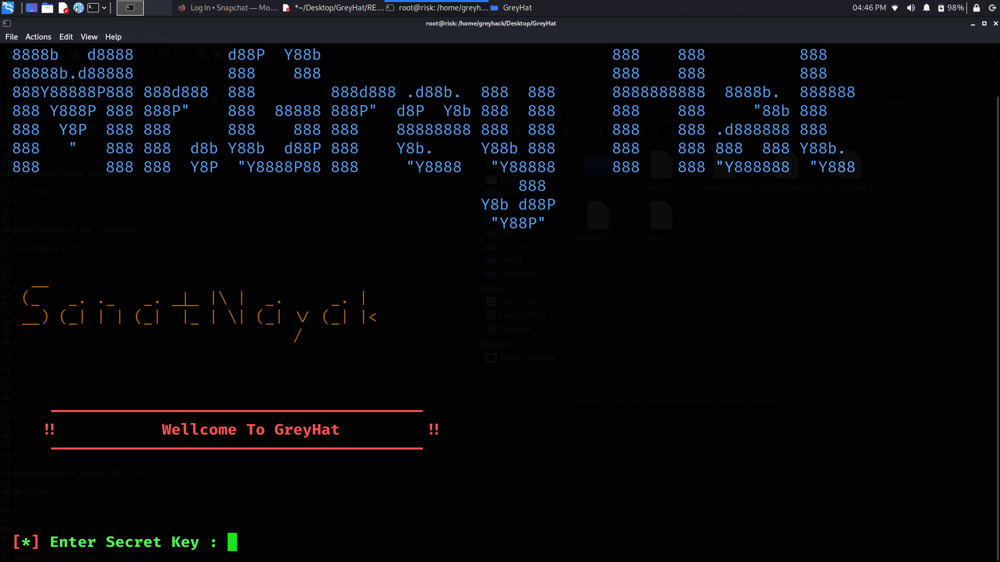
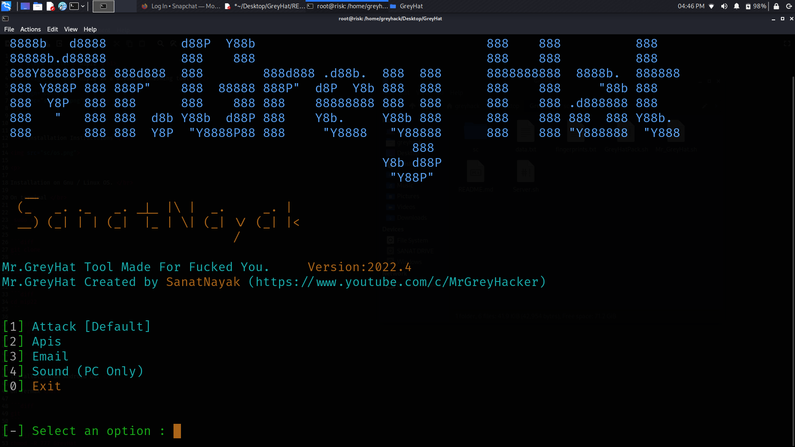
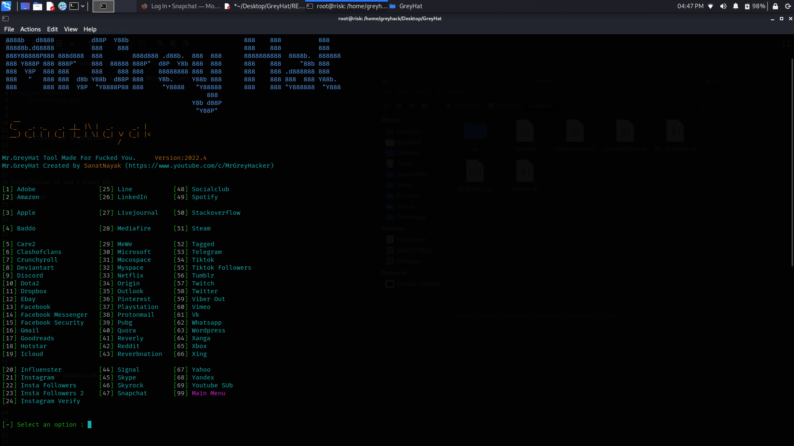

# GreyHat
<h1 align="center"> GreyHat </h1>
 
 <h2 align="center"> GreyHat Is A Advanced Phishing Tool </h2> 

<p align="center">
  </br>
</p>
<p align="center">
  </br>
</p>


<h4> Installation Instractuions </h4>


Installation on Gnu / Linux OS. </br>

On terminal </br>

 <br/> <br/> <br/>

```diff
 sudo su 
```

```diff
git clone 
```
```diff
chmod -R 777 GreyHat 
```

```diff
cd GreyHat
```

```diff
bash GreyHat.sh
```

</br> </br>


Installation on Android OS. </br>

On Termux </br>

```diff
git 
```

```diff
chmod -R 777 GreyHat
```

```diff
cd GreyHat
```

```diff
bash Mr_GreyHat.sh
```

</br> </br>

</p>


<h3 align="center">
Feautures and Properties.
</h3>

<p align="center">
GreyHat is a modern and advanced cyber security program for computers with Gnu / Linux operating system and mobile phones and tablets with android operating system, for educational purposes.
</p>

 
<p>
